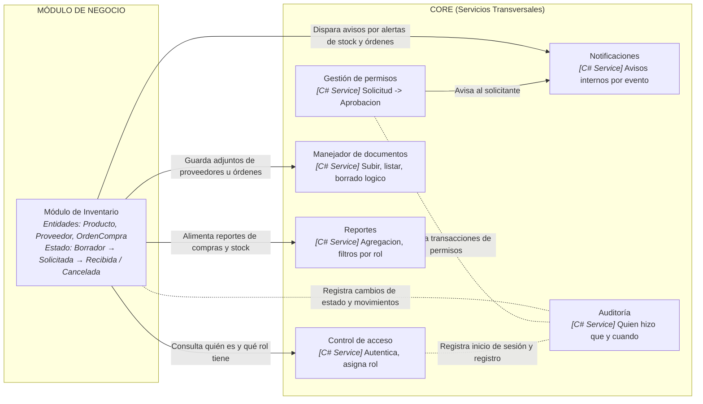

# ProyectoFinalProg3_Inventary
# Descripcion del proyecto
Este es el repositorio oficial del proyecto final de programación 3 basado en un sistema de inventario para un negocio pequeño desarrollado por Richard Hernández.

## Diagrama de componentes hecho en mermaid

