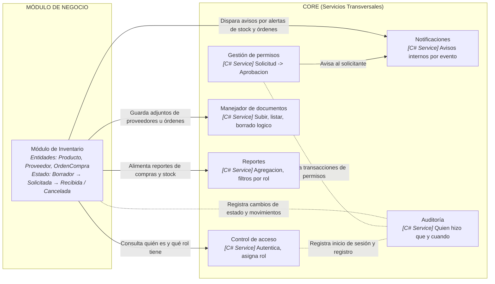

# ProyectoFinalProg3_Inventary
# Descripcion del proyecto
Este es el repositorio oficial del proyecto final de programación 3 basado en un sistema de inventario para un negocio pequeño desarrollado por Richard Hernández.

## Diagrama de componentes hecho en mermaid



### 4 Entidades base y relaciones
Cree las siguientes clases a continuacion:

1. **DetalleOrden** — Atributos: `Id`, `Cantidad`, `Precio`, `Subtotal`. Relaciones: `OrdenCompra` y `Producto`.
2. **OrdenCompra** — Atributos: `Id`, `FechaCreacion`, `Total`, `CreadoPorUsuarioId`, `ProveedorId`. Relaciones: `Proveedor` y `Detalles`.
3. **Producto** — Atributos: `Id`, `Nombre`, `Codigo`, `Precio`, `StockActual`, `StockMinimo`, `ProveedorId`. Relaciones: `Proveedor` y `DetallesOrden`.
4. **Proveedor** — Atributos: `Id`, `Nombre`, `Cedula`, `Telefono`, `Email`. Relaciones: `Productos` y `OrdenesCompra`.

#### Bitacora con el Agente - Punto 3
Crítica de la bitácora con el agente.

Le pedí que criticara el diagrama de componentes de acuerdo a las seis señales y me confirmó lo que supuse, la frontera de la dependencia Core- Negocio es unidireccional y correcta, pero me señaló que el componente Reportes no tenía conexiones en el diagrama visual, por lo que este agregó la relación de alimentación de reportes.

Error puntual que noté:
El agente me dio el diagrama corregido pero cometió un error, en la parte de los componentes del core no estaba el mensaje característico que decía de que se encargaba cada componente. tuve que corregirlo finalmente.

## Requisitos previos
- .NET SDK (versión 8.0 o superior)
- Visual Studio 2022 / VS Code

## Instrucciones de ejecución

1. **Clonar el repositorio:**
   ```bash
   git clone [https://github.com/richard-dev-st/ProyectoFinalProg3_Inventary.git](https://github.com/richard-dev-st/ProyectoFinalProg3_Inventary.git)
   cd ProyectoFinalProg3_Inventary

Restaurar paquetes y dependencias:
dotnet restore

Compilar y ejecutar el proyecto:
dotnet build
dotnet run
