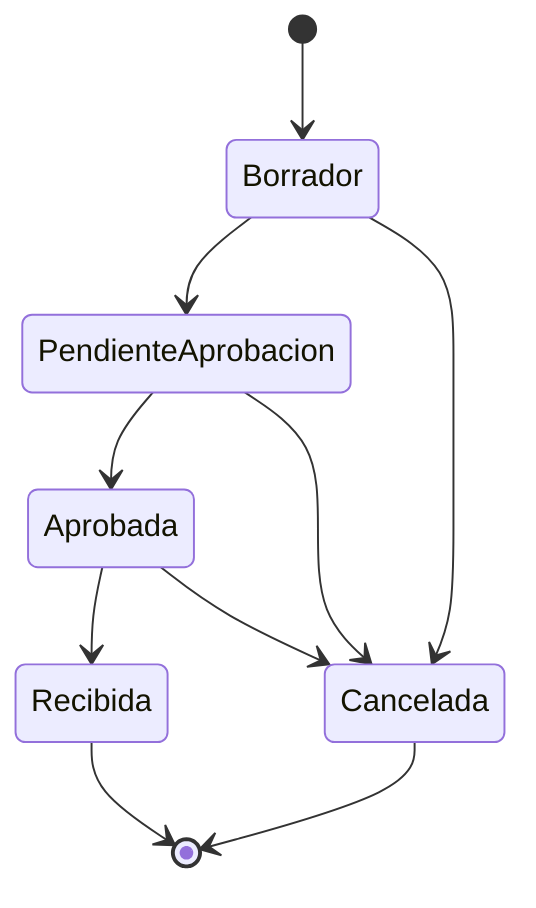

# Máquina de Estados - OrdenCompra

Documento que describe la máquina de estados de la entidad central de negocio **`OrdenCompra`** (RF-NEG-03, RD-04, RF-NEG-04, RF-NEG-05).

## Estado actual de la entidad

La entidad `OrdenCompra` (proyecto `Business.Inventory`) expone el atributo `Estado` de tipo `EstadoOrden`, cuyo `set` es privado. Todo cambio de estado pasa obligatoriamente por los métodos de negocio definidos en la propia entidad (`EnviarAAprobacion`, `Aprobar`, `Recibir`, `Cancelar`), los cuales validan la transición contra un único mapa de transiciones permitidas declarado en un solo lugar (`TransicionesPermitidas`).

- **Entidad:** `Business.Inventory.Entities.OrdenCompra`
- **Enum de estados:** `Core.Domain.Entities.Enums.EstadoOrden`
- **Lugar único de las transiciones:** `OrdenCompra.TransicionesPermitidas` (RD-04)

## Estados declarados (RF-NEG-03)

| # | Estado | Descripción | Tipo |
| :---: | :--- | :--- | :--- |
| 1 | `Borrador` | La orden se está construyendo; aún puede editarse. | Activo |
| 2 | `PendienteAprobacion` | La orden fue enviada y espera decisión del administrador. | Activo |
| 3 | `Aprobada` | La orden fue aprobada y puede recibirse. | Activo |
| 4 | `Recibida` | El inventario llegó y se registró. | **Terminal** (RF-NEG-05) |
| 5 | `Cancelada` | La orden se canceló; no puede cambiar de estado. | **Terminal** (RF-NEG-05) |

## Tabla de transiciones permitidas (RD-04)

Igual que la tabla de Gestión de permisos de los Requerimientos del Core.

| Desde | Hacia | Quién la ejecuta | Condición |
| :--- | :--- | :--- | :--- |
| `Borrador` | `PendienteAprobacion` | Estándar / quien crea la orden | La orden tiene al menos un detalle y un proveedor asignado, y el usuario la envía. |
| `Borrador` | `Cancelada` | Estándar / Administrador | El creador desiste o el administrador descarta la orden en borrador. |
| `PendienteAprobacion` | `Aprobada` | Administrador | El administrador evalúa el presupuesto y aprueba la orden. |
| `PendienteAprobacion` | `Cancelada` | Administrador | El administrador rechaza o cancela la orden. |
| `Aprobada` | `Recibida` | Estándar | El inventario llega físicamente y se registra la recepción en el almacén. |
| `Aprobada` | `Cancelada` | Administrador | El proveedor informa que no puede despachar la orden. |
| `Recibida` | *(ninguna)* | — | Estado terminal: no admite transiciones de salida (RF-NEG-05). |
| `Cancelada` | *(ninguna)* | — | Estado terminal: no admite transiciones de salida (RF-NEG-05). |

## Transiciones prohibidas explícitas (RF-NEG-04)

El mapa `TransicionesPermitidas` valida que solo existan las transiciones de la tabla anterior. Cualquier intento de transición no listada lanza una excepción de negocio controlada (`InvalidOperationException`), por ejemplo:

- `Recibida` → cualquier estado (terminal).
- `Cancelada` → cualquier estado (terminal).
- `Borrador` → `Aprobada` de forma directa (debe pasar por `PendienteAprobacion`).
- `PendienteAprobacion` → `Recibida` sin pasar por `Aprobada`.
- `Aprobada` → `PendienteAprobacion` (una orden aprobada no vuelve a espera).

## Diagrama

